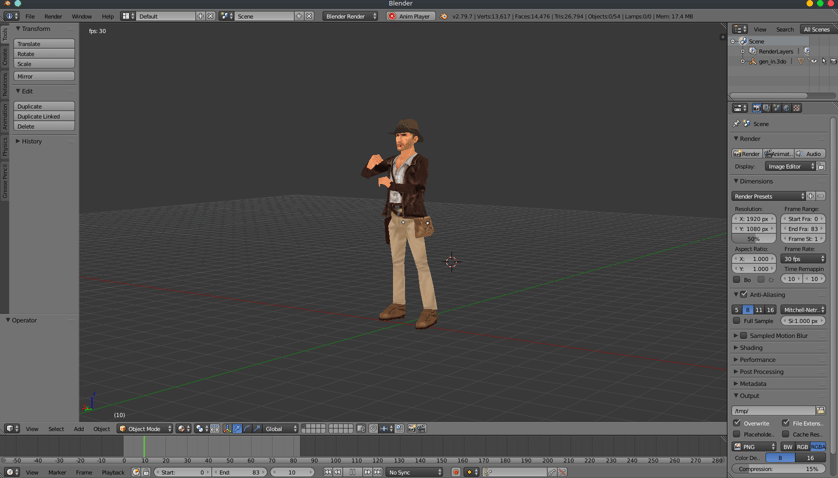
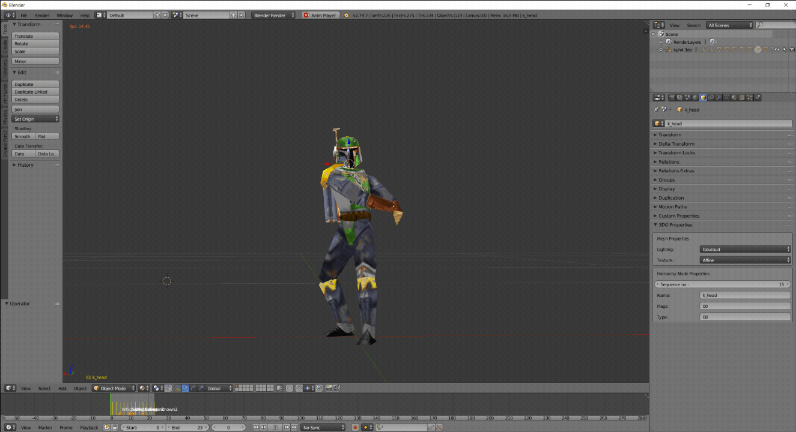
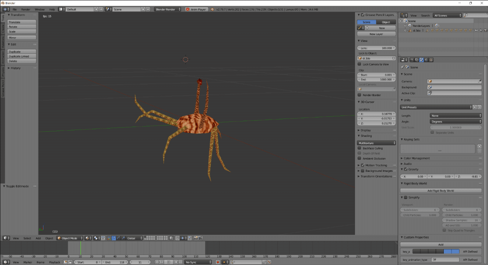
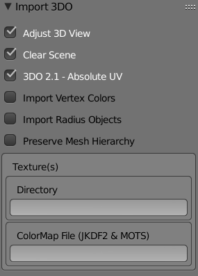
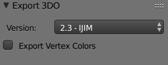
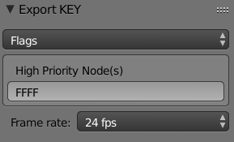
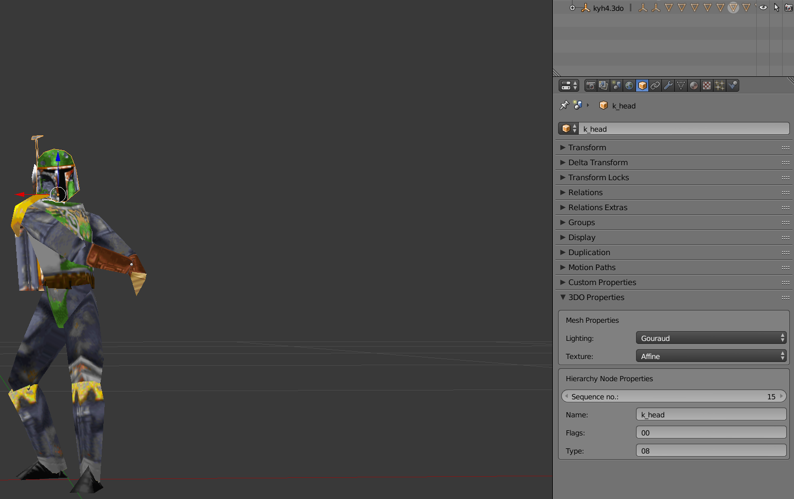
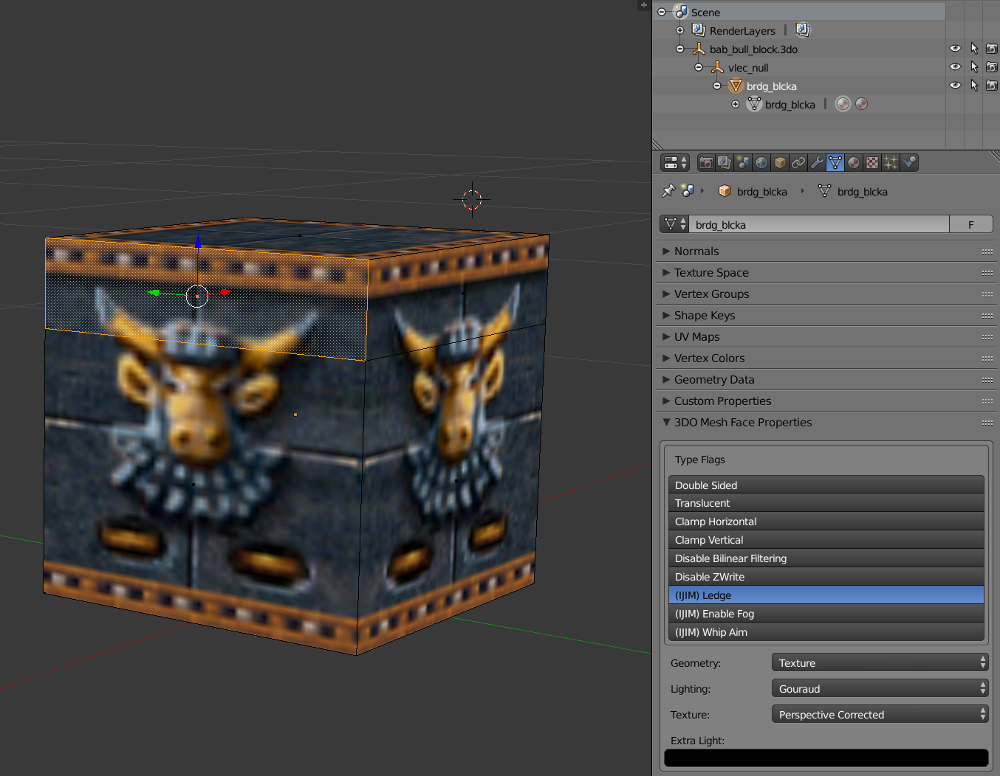

# Blender 2.79 addon for the games based on Sith game engine

Addon provides Blender game assets import/export scripts for the games based on Sith game engine:
  - Star Wars Jedi Knight: Dark Forces II
  - Star Wars Jedi Knight: Mysteries of the Sith
  - Star Wars: DroidWorks
  - Indiana Jones and the Infernal Machine
  - Grim Fandango - *Only supported importing of text format 3DO models*

## Features
  - Import/Export .3do models
  - Edit 3DO mesh & polygon properties in Blender
  - Import/Export .key mesh animations  
    Armature animations not supported (yet)
  - Import .mat textures

## Requirements
Blender 2.79, you can download it [here](https://download.blender.org/release/Blender2.79/latest/). 

## Installation
   1. Download `sith.zip` file from the [Releases](https://github.com/smlu/blender-sith/releases) page.
   2. Open Blender and select `File > User Preferences > Add-ons > Install Add-on from File`  
      and select the downloaded `sith.zip` file.
   3. Enable the addon by clicking the checkbox next to the add-on name.
   4. Click the `Save User Settings` button in the lower left and close the preferences window.

## Usage
### Importing 3DO model
   1. Go to `File > Import > Sith Game Engine 3D Model (.3do)`
   2. Find and select `*.3do` model file  
   3. Import options  
      In the opened import dialog window you have import options under `Import 3DO` section (bottom left). Here you can check/uncheck different options and set path to the folder containing texture files (.mat) and ColorMap file (.cmp)  
        
      *Note: By default addon tries to find required texture(s) and ColorMap file of the imported model at the location of it's file.  
      I.e.: <model_path>/mat, <model_path>/misc/cmp, <model_path>/../mat, <model_path>/../misc/cmp, <model_path>/../../misc/cmp*
   4. Then click the `Import 3DO` button to import model into Blender.  

### Exporting 3DO model
   1. Go to `File > Export > Sith Game Engine 3D Model (.3do)`
   2. Select path, name the file  
      *Note: The file name must not be longer then 64 characters.*
   3. In the export options section select the 3DO file version  
      
   4. Then click the `Export 3DO` button to export object(s) to 3DO file.

### Importing KEY animation
   1. First import 3DO model that animation is for  
      *Note: Which key file belongs to which 3DO model cannot be easy to figured out because single model can have many different animations.
      One thing to do is opening puppet file (`.pup`) located in misc/pup folder and see which animations belongs to the same game "actor". Another way is to open up `.3do` and `.key` file and see if `.3do` file contains all mesh names used by the `.key` file.*
   2. Go to `File > Import > Sith Game Engine Animation (.key)`
   3. Select the `*.key` file and click the `Import KEY` button

### Exporting KEY animation
   1. Go to `File > Export > Sith Game Engine Animation (.key)`
   2. (Optional) Set additional export options in the `Export KEY` section (bottom left)  
      
   3. Select path, name the file and click `Export KEY`  
      *Note: The file name must not be longer then 64 characters*

### Importing MAT texture
   1. Go to `File > Import > Sith Game Engine Texture (.mat)`
   3. Select the `*.mat` file and click the `Import MAT` button  

### Editing
Additional from importing and exporting Sith engine formats addon adds extra UI panels for editing 3DO file specific data.

#### 1. Object 3DO Properties  
   
   The Sequence number is the node position number in the mesh node hierarchy list in the 3DO file. 
   When creating the new model by default this number is `-1` and addon will auto-set the node position in the hierarchy list based on the object's hierarchy in Blender when exporting to 3DO file. If the node name is not set addon will take the object mesh name from Blender when exporting to 3DO file.  

#### 2. Mesh Face Properties   
   