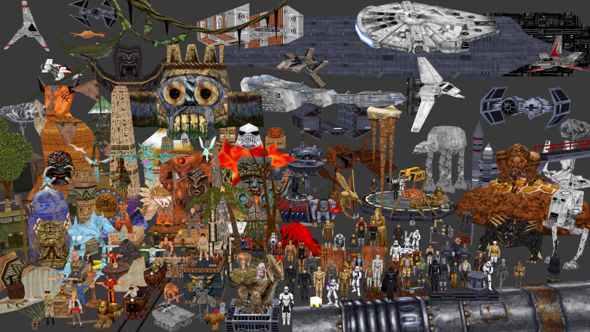
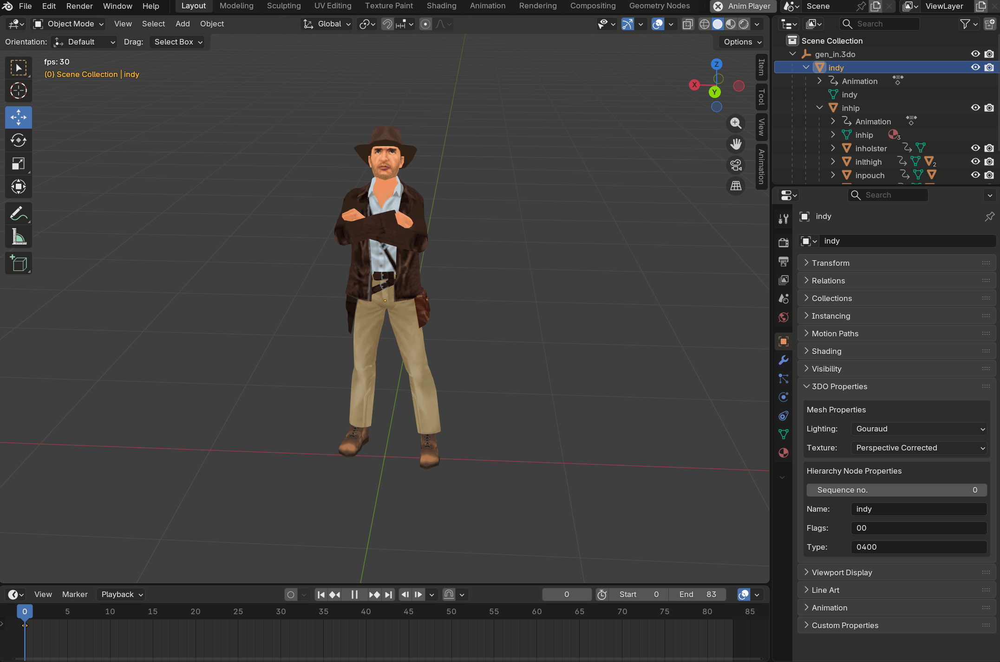

<div align="center">

# 🎮 Sith Engine Toolkit for Blender

[](https://www.blender.org/)
[](LICENSE)
[]()

**Import/Export assets for classic LucasArts games**

[](demo/blsthbn.png)

[🚀 Installation](#-installation) • [📖 Usage Guide](USAGE.md) • [🔧 Troubleshooting](USAGE.md#-troubleshooting)

</div>

---

## 📑 Table of Contents

- [Supported Games](#️-supported-games)
- [Features](#-features)
- [Quick Start](#-quick-start)
- [Requirements](#-requirements)
- [Installation](#-installation)
- [Usage](USAGE.md)
- [Contributing](#-contributing)

---

## 🕹️ Supported Games

- Star Wars Jedi Knight: Dark Forces II
- Star Wars Jedi Knight: Mysteries of the Sith
- Star Wars: DroidWorks
- Indiana Jones and the Infernal Machine
- Grim Fandango *(text format 3DO import only)*

---

## ✨ Features
<div align="center">

</div>
<div align="center">
</div>

---

<table>
<tr>
<td width="50%">

### 📦  3DO Models
- ✅ Import/Export all versions (2.1, 2.2, 2.3)
- 🎨 Full mesh hierarchy support
- 🔧 Edit properties in Blender UI
- 🎯 Vertex colors & UV mapping

### 🎬 KEY Animations
- ✅ Import/Export mesh animations
- 🎞️  Keyframe markers support
- ⚙️ High-priority node configuration
- 📊 Frame rate control (15-60 fps)

</td>
<td width="50%">

### 🖼️ MAT Textures
- ✅ Import as Blender materials
- 🎞️ Import all texture cells
- 🎨 8-bit, 16-bit, 24-bit & 32-bit formats
- 🔧 ColorMap (.cmp) support

### 🛠️ Advanced Editing
- 🎛️ Per-face properties & flags
- 🔦 Lighting & texture modes
- 🎨 Extra light color support
- ⚡ Multi-face batch editing

</td>
</tr>
</table>


## ⚡ Quick Start

1. **Install**: Download from [Releases](https://github.com/smlu/blender-sith/releases) and install via Blender Extensions
2. **Import Model**: `File > Import > Sith Game Engine 3D Model (.3do)`
3. **Import Textures**: Use MAT Directory option or let auto-search find them
4. **Import Animation**: `File > Import > Sith Game Engine Animation (.key)`
5. **Edit Properties**: Use the 3DO Properties panels (see [Usage Guide](USAGE.md))
6. **Export**: `File > Export` to save your modifications

> 📖 **Detailed instructions**: See the [Usage Guide](USAGE.md) for complete documentation.

---

## 📋 Requirements

> **Blender 5.0+** is required for this version of the add-on.

🔗 [Download Blender](https://www.blender.org/download/)

---

## 🚀 Installation

### Method 1: From Release (Recommended)

1. 📥 **Download** the latest ZIP from the [Releases](https://github.com/smlu/blender-sith/releases) page
2. 🔧 **Open Blender** and go to `Edit > Preferences > Add-ons`
3. 📂 **Install**: Click the dropdown menu (▼) at the top-right and select `Install from Disk...`
4. 📁 **Select** the downloaded ZIP file
5. ✅ **Enable** the add-on: Check the box next to **Sith Game Engine Formats (.3do, .mat, .key)**
6. 🎉 **Done!** Import/export options appear in `File > Import` and `File > Export` menus

### Method 2: From Source

```bash
# Clone or download the repository
git clone https://github.com/smlu/blender-sith.git

# ZIP the `sith` folder and install via Blender Preferences
```

> 💡 **Note**: In Blender 5.0, add-ons are managed through the Extensions system.

---

## 📖 Usage

For complete documentation on importing, exporting, and editing, see the **[Usage Guide](USAGE.md)**.

### Quick Reference

- **Import 3DO**: `File > Import > Sith Game Engine 3D Model (.3do)`
- **Export 3DO**: `File > Export > Sith Game Engine 3D Model (.3do)`
- **Import KEY**: `File > Import > Sith Game Engine Animation (.key)`
- **Export KEY**: `File > Export > Sith Game Engine Animation (.key)`
- **Import MAT**: `File > Import > Sith Game Engine Texture (.mat)`
- **Edit Properties**: `Properties Panel > Object Properties > 3DO Properties`
- **Edit Faces**: `Properties Panel > Data Properties > 3DO Mesh Face Properties` (Edit Mode)

> 📖 See [USAGE.md](USAGE.md) for detailed options, screenshots, and troubleshooting.

---

## 🤝 Contributing

Contributions are welcome! Feel free to:
- 🐛 Report bugs via [Issues](https://github.com/smlu/blender-sith/issues)
- 💡 Suggest features or improvements
- 🔧 Submit pull requests

---

##  Links

- 📦 [Releases](https://github.com/smlu/blender-sith/releases) - Download the latest version
- 🐛 [Issue Tracker](https://github.com/smlu/blender-sith/issues) - Report bugs or request features
- 🌐 [Blender.org](https://www.blender.org/) - Get Blender

---

<div align="center">

**⭐ If you find this project useful, consider giving it a star!**

</div>
