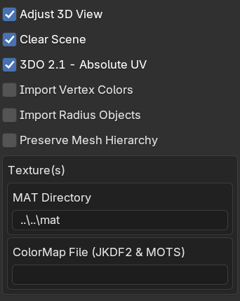
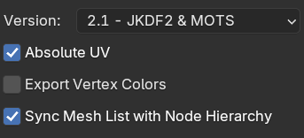
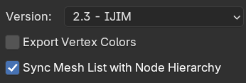
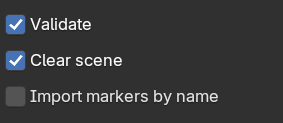
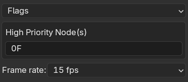
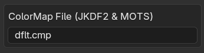
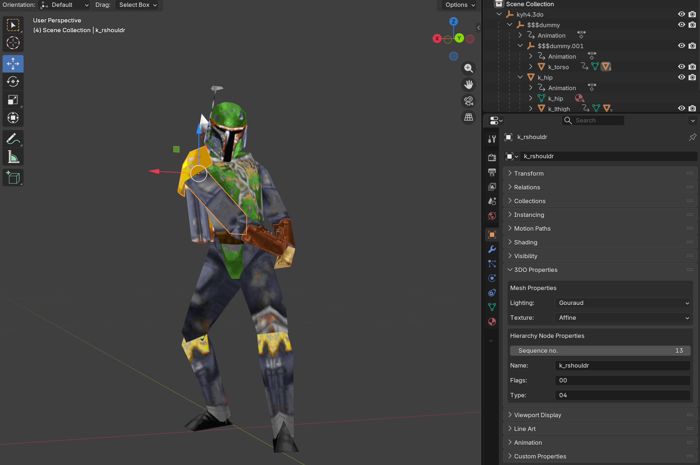
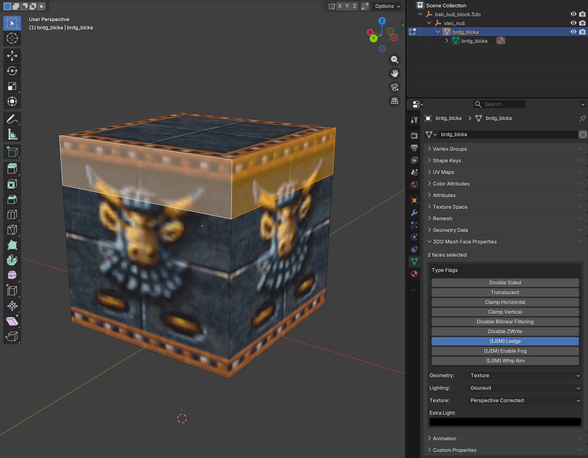

# 📖 Usage Guide

Complete guide for using the Sith Engine Toolkit add-on for Blender 5.0.

---

## 📥 Importing 3DO Models

**Menu**: `File > Import > Sith Game Engine 3D Model (.3do)`

### Import Options

| Option | Description |
|--------|-------------|
| 🎥 **Adjust 3D View** | Auto-frames model with optimal camera distance |
| 🧹 **Clear Scene** | Removes existing content before import |
| 📐 **3DO 2.1 - Absolute UV** | Converts absolute to relative UVs (JKDF2/MOTS) |
| 🎨 **Import Vertex Colors** | Imports per-vertex color data |
| ⭕ **Import Radius Objects** | Creates wireframe sphere objects for radii |
| 📋 **Preserve Mesh Hierarchy** | Maintains original mesh order |
| 📁 **MAT Directory** | Folder path for `.mat` texture files |
| 🎨 **ColorMap File** | Path to `.cmp` file (JKDF2/MOTS) |

> 💡 **Auto-search**: The add-on automatically searches for textures in:  
> `<model>/mat`, `<model>/misc/cmp`, `<model>/../mat`, `<model>/../misc/cmp`, `<model>/../../misc/cmp`

---

## 📤 Exporting 3DO Models

**Menu**: `File > Export > Sith Game Engine 3D Model (.3do)`

### Export Options

| Option | Description |
|--------|-------------|
| 🎯 **Version** | 2.1 (JKDF2/MOTS), 2.2 (IJIM RGB), 2.3 (IJIM RGBA) |
| 📐 **Absolute UV** | Fixed UV coordinates (2.1 only) |
| 🎨 **Export Vertex Colors** | Includes vertex color data |
| 🔄 **Sync Mesh List** | Aligns mesh sequence with hierarchy nodes |

> ⚠️ **Filename Limit**: Max 32 characters (64 for IJIM)

---

## 🎬 Importing KEY Animations

**Menu**: `File > Import > Sith Game Engine Animation (.key)`

### Steps

1. 📦 **Import the 3DO model** first
2. 📂 **Select the `.key` file**
3. ⚙️ **Configure options**:
   - ✅ **Validate**: Checks for required animation nodes
   - 🧹 **Clear scene**: Removes existing animation data
   - 🏷️ **Import markers by name**: Uses names vs. frame numbers

> 💡 **Tip**: Match KEY files to 3DO models using puppet files (`.pup`) in the `misc/pup` folder, or compare node names between `.3do` and `.key` files.

---

## 🎬 Exporting KEY Animations

**Menu**: `File > Export > Sith Game Engine Animation (.key)`

### Export Options

| Option | Description |
|--------|-------------|
| 🚩 **Flags** | Animation behavior (loop, pause, fade, etc.) |
| ⭐ **High Priority Nodes** | Hex value for priority nodes (default `0xFFFF`) |
| 🎞️ **Frame Rate** | Animation FPS (15-60) |

> ⚠️ **Filename Limit**: Max 32 characters (64 for IJIM)

---

## 🖼️ Importing MAT Textures

**Menu**: `File > Import > Sith Game Engine Texture (.mat)`

### Steps

1. 📂 Select the `.mat` file
2. 🎨 (Optional) Specify ColorMap `.cmp` for JKDF2/MOTS
3. ✅ Click `Import MAT`

---

## 🎛️ Editing 3DO Properties

The add-on provides custom UI panels for editing 3DO-specific data directly in Blender.

### 🎯 Object 3DO Properties

**Location**: `Properties Panel > Object Properties > 3DO Properties`

#### Available Properties

| Property | Description |
|----------|-------------|
| 💡 **Lighting Mode** | In-game lighting (Gouraud, Flat, etc.) |
| 🖼️ **Texture Mode** | Mapping mode (Perspective Corrected, Affine) |
| 🔢 **Sequence No.** | Node position (-1 = auto-assign) |
| 🏷️ **Name** | Node name (defaults to object name) |
| 🚩 **Flags** | Node behavior flags (hex) |
| 🎯 **Type** | Node type identifier (hex) |

---

### 🔷 Mesh Face Properties

**Location**: `Properties Panel > Data Properties > 3DO Mesh Face Properties`  
**Mode**: Edit Mode with Face Select enabled

#### Type Flags
- ↔️ **Double Sided** - Renders both sides
- 🌫️ **Translucent** - Alpha blending enabled
- 📏 **Clamp Horizontal/Vertical** - Texture clamping
- 🚫 **Disable Bilinear Filtering** - Point filtering
- 📺 **Disable ZWrite** - Depth buffer control
- 🧗 **IJIM: Ledge** - Climbable surface
- 🌁 **IJIM: Enable Fog** - Fog rendering
- 🔗 **IJIM: Whip Aim** - Whip target spot

#### Modes
- 📐 **Geometry Mode**: Not Drawn, Wireframe, Solid Color, Texture
- 💡 **Lighting Mode**: Fully Lit, Flat, Gouraud, Gouraud + Vertex Colors
- 🖼️ **Texture Mode**: Affine, Perspective Corrected
- 🔦 **Extra Light**: Additional RGBA lighting

> ⚡ **Multi-face editing**: Select multiple faces and change only the properties you need - other values are preserved!

---

## 🔧 Troubleshooting

### ❌ File path validation errors

All import/export operators validate file paths. 
- ✅ Ensure you've selected an **existing file** for import
- ✅ Ensure you've selected a **valid directory** for export
- ✅ Check file extensions (.3do, .key, .mat)

### 🎥 "Adjust 3D View" doesn't work

This feature requires an active 3D View area.
- ⚠️ Won't work in headless/background mode
- ⚠️ Won't work in custom layouts without a 3D viewport
- ✅ Ensure you have a 3D View visible when importing

### 🖼️ Missing textures after import

Textures not showing up?
- 🔍 Use **"MAT Directory"** option to explicitly point to your texture folder
- 📁 Check the default search locations are correct
- ✅ Ensure `.mat` files exist in the specified directory

### 🎨 Face property changes not applying

Can't edit face properties?
- ✅ Ensure you're in **Edit Mode**
- ✅ Enable **Face Select** mode (hotkey: 3)
- ✅ Have at least one face **selected**

---

[← Back to README](README.md)
